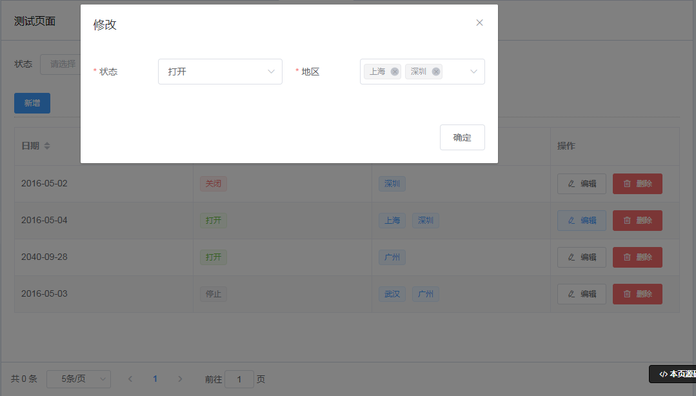

# 【d2-crud-plus】面向配置的crud编程
基于d2-admin 的 d2-crud 的扩展,简化d2-crud配置，快速开发crud功能。   

<a href='https://gitee.com/greper/d2-crud-plus'></a>
<a href='https://github.com/greper/d2-crud-plus'></a>
    

[](https://lerna.js.org/)

<a href="https://github.com/d2-projects/d2-admin" target="_blank"></a>

## fast-crud

支持`vue3`的`fast-crud`已发布，开发crud更快、更强、更爽。

文档地址： http://fast-crud.docmirror.cn/    
示例地址： [antdv版](http://fast-crud.docmirror.cn/antdv/)  /  [element版](http://fast-crud.docmirror.cn/element/)   /  [native-ui版](http://fast-crud.docmirror.cn/native/)     
仓库地址： [Github](https://github.com/fast-crud/fast-crud)  /  [Gitee](https://gitee.com/fast-crud/fast-crud)


## 不再维护通知
抱歉，由于精力有限，d2-crud-plus将不再维护     
各位可以尝试使用更强大的fast-crud（仅支持vue3，不兼容d2-crud-plus，无法从d2p直接升级到fast-crud）


## 帮助文档 
%%%%%%%%%%%%%%%%%%%%%%% 帮助文档 ↓%%%%%%%%%%%%%%%%%%%%%%%%%%%%
> 
>GitHub Pages   
>https://greper.github.io/d2-crud-plus/
>
>码云（国内访问推荐 ）  
>http://d2-crud-plus.docmirror.cn/d2-crud-plus/   
>
>示例演示   
>http://preview.d2-crud-plus.docmirror.cn/D2CrudPlusExample/index.html
>
%%%%%%%%%%%%%%%%%%%%%%% 帮助文档 ↑%%%%%%%%%%%%%%%%%%%%%%%%%%%%
## 特性

1. 简洁至上： 以最少的配置帮助你简化crud开发。
2. 字段类型： 丰富的字段类型，大幅减少代码量。
3. 快： 开发crud，快的不可思议！！！
4. 自定义： 再困难的需求，也能实现。
5. 权限管理： RBAC权限管理示例。
6. 代码生成： 根据数据表生成前后端代码，一气呵成。  

## 面向配置的crud编程
 
### 1. 简单的crud配置
开发过程中主要对crud.js进行代码编写 
```js
export const crudOptions = (vm)=>{ // vm即this
   return {
     columns: [
       {
         title: '日期',
         key: 'createDate',
         type: 'date', //字段类型为时间选择器datepicker,根据类型可自动生成默认配置
         search: {//查询配置，默认启用查询
           disabled: true //【可选】true禁止查询,默认为false
         },
         form: {//form表单的配置
           disabled: true, //禁止添加输入与修改输入【可选】默认false
         }
       },
       {
         title: '状态',
         key: 'status',
         search: {},//启用查询
         type: 'select', //字段类型为选择框
         form: { //配置添加和编辑，根据form的配置自动生成addTemplate和editTemplate
           rules: [//【可选】添加和修改时的校验规则，不配置则不校验
             { required: true, message: '请选择状态' }
           ]
         },
         dict: { //数据字典配置
           url: '/api/dicts/StatusEnum' //远程获取数据字典
         }
       },
       {
         title: '地区', 
         key: 'province', 
         search: {},//启用查询
         type: 'select', //字段类型为选择框
         form: {
           rules: [{ required: true, message: '请选择地区' }],
           component: { //添加和修改时form表单的组件，支持任何v-model组件
             props: { //配置自定义组件的属性
               filterable: true, //可过滤选择项
               multiple: true, //支持多选
               clearable: true //可清除
             }
           }
         },
         dict: {  //本地数据字典
           data: [
             { value: 'sz', label: '深圳' }, 
             { value: 'gz', label: '广州' }, 
             { value: 'wh', label: '武汉' }, 
             { value: 'sh', label: '上海' }
           ]
         }
       }
     ]
   }
}
``` 
### 2. 一个完全体crud就出来了   




### 3. 现在就去开始吧
* [帮助指南](http://d2-crud-plus.docmirror.cn/d2-crud-plus/guide/)

* [快速开始](http://d2-crud-plus.docmirror.cn/d2-crud-plus/guide/quickstart.html)


## 帮助文档 
%%%%%%%%%%%%%%%%%%%%%%% 帮助文档 ↓%%%%%%%%%%%%%%%%%%%%%%%%%%%%
> 
>GitHub Pages   
>https://greper.github.io/d2-crud-plus/
>
>码云（国内访问推荐 ）  
>http://d2-crud-plus.docmirror.cn/d2-crud-plus/   
>
>示例演示   
>http://preview.d2-crud-plus.docmirror.cn/D2CrudPlusExample/index.html
>
%%%%%%%%%%%%%%%%%%%%%%% 帮助文档 ↑%%%%%%%%%%%%%%%%%%%%%%%%%%%%

## 他们在用

* [甘肃某门票分时预约及数据分析系统](https://tms.yougansu.com/orderManage/)
* [表格后台生成](https://cloud.battcn.com/)  crud配置从后台获取，通过后台配置即可生成crud表格 [开源地址](https://gitee.com/battcn/wemirr-platform)   
* [ji-admin-ui](https://github.com/power4j/ji-admin-ui) , 配套后端[ji-admin](https://github.com/power4j/ji-boot)
* 还有很多的小伙伴做的是内部管理系统，没法分享出来  
  
## 联系作者

[欢迎bug反馈，需求建议，技术交流等（请备注d2-crud-plus）](http://d2-crud-plus.docmirror.cn/d2-crud-plus/guide/contact.html)


## 赞赏
支持维护，给我打打鸡血,抱拳抱拳    

